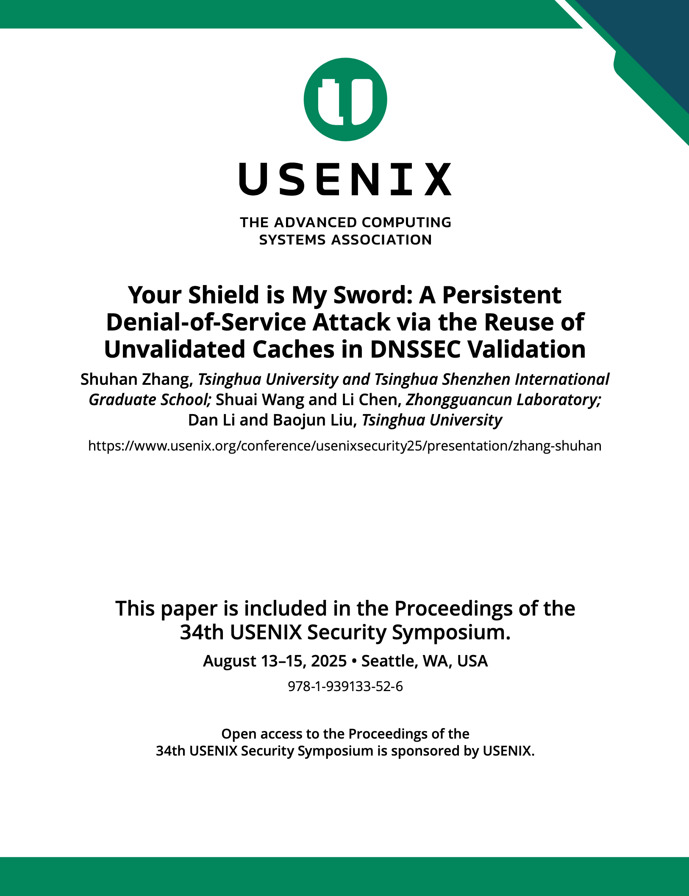

# Proof-of-Concept of the RUC Attack

<p><a href="https://www.usenix.org/conference/usenixsecurity25/presentation/zhang-shuhan"></a></p>

This is the artifact for the Proof-of-Concept of the RUC attack, paper titled **"Your Shield is My Sword: A Persistent Denial-of-Service Attack via the Reuse of Unvalidated Caches in DNSSEC Validation"**.

The artifact includes the Dockerfiles of the tested DNS software and the victim domains’ nameserver, scripts for the three RUC attack variants, and detailed instructions to facilitate the vulnerability reproduction within a controlled environment.

For more details, please refer to [our paper](https://www.usenix.org/conference/usenixsecurity25/presentation/zhang-shuhan) at USENIX Security '25 and its [artifact appendix](https://secartifacts.github.io/usenixsec2025/appendix-files/sec25cycle2ae-final10.pdf).

## 🌟 Recent updates
Please refer to the [main branch](https://github.com/NASP-THU/RUC_PoC) for the updated version of this artifact.
- **[April 2026]** Preserve the original record TTLs in the manipulated responses, so as to further restrict the capability of RUC attackers (code changes in [attack_api](victim_config/attack_api/)).
- **[March 2026]** The authoritative nameservers of the apex domains for RUC tests (`dnssec-ruc.xyz` and `dnssec-ruc-ms.xyz`) have been shifted to Cloudflare. The NS and DNSKEY records in the [apex zonefile](victim_config/dnssec-ruc.xyz/db.dnssec-ruc.xyz) have been updated correspondingly. For Linux-based resolvers, the scripts and workflow to reproduce RUC remain unchanged.
- **[March 2026]** For Microsoft DNS resolver, RUC now can be reproduced within the local virtual machine network. Please refer to the [instructions](https://github.com/NASP-THU/RUC_PoC/blob/main/environment_setup.md#microsoft-dns-resolver) for details.

## Introduction
The Domain Name System Security Extensions (DNSSEC), designed to ensure the authenticity and integrity of DNS data, has been deployed in over 90% of top-level zones. To mitigate service outages due to DNSSEC misconfigurations, DNS resolvers allow the public to troubleshoot resource records without enforcing DNSSEC validation. Unfortunately, given no clear specifications, many resolvers mix the caching and reusing of DNS data introduced via troubleshooting with those in routine operations. This opens a new attack surface that thwarts domain resolution. 

Based on the above finding, we present a novel Denial-of-Service attack named RUC, which turns DNSSEC from a shield into a sword that breaks the resolution of domains under DNSSEC-signed zones. Specifically, adversaries can exploit the troubleshooting mechanism of DNSSEC to inject forged data into the resolver cache. In subsequent routine resolutions, the resolver continuously reuses the unvalidated data, leading to persistent DNSSEC validation failure. Due to the unrestricted TTL of the unvalidated caches, a single injection can cause a resolution outage lasting over 24 hours.

Our Internet-wide measurements reveal that RUC affects mainstream DNS software, public DNS services and DNSSEC-compliant open resolvers. After disclosure, BIND, Cloudflare and OpenDNS have acknowledged the vulnerabilities and patched based on our suggestions. Our work calls for formal guidelines on handling troubleshooting data in DNSSEC.

## Artifact composition
To facilitate the vulnerability reproduction of the RUC attack within a controlled environment, this artifact provides the Proof-of-Concept of RUC, which consists of the following components:
- Dockerfiles of the tested DNS software and authoritative nameservers of the victim domains (see [dockers/](dockers/))
- Scripts to launch each of the three RUC attack variants within the controlled environment (see [poc_scripts/](poc_scripts/))
- Detailed instructions on the setup of the testing environment (see [environment_setup.md](environment_setup.md)) and steps to reproduce three RUC attack variants (see [ruc_reproduction.md](ruc_reproduction.md))

Due to ethics considerations, our artifact excludes scripts and datasets that could potentially be exploited by adversaries to launch real-world attacks. Specifically, regarding the scripts for large-scale open resolver measurement and the fragmentation-based off-path attacks, we are concerned that adversaries could abuse the scripts to discover and attack vulnerable resolvers or domains in the wild, hence we decide not to publish them. Similarly, as for the measurement results of the vulnerable open resolvers and the fragmentation-capable nameservers, we do not disclose them due to the consideration that they might be exploited by adversaries to launch attacks in the real world.

## Dependencies
### Hardware dependencies
This artifact can run in standard CPU-based environments, and no specialized hardware is required. Nevertheless, to ensure the successful build of the DNS software docker images, we recommend that the host machine for setting up the Linux-based test environment is equipped with a number of CPU cores ≥ 4 and RAM ≥ 8GB.

For Microsoft DNS, we provide a virtual machine .ova file that can be imported into a virtual machine tool, e.g., **VMware Workstation**. Note that this virtual machine is only compatible with host machines based on **x86-64 (AMD64)** architecture.

### Software dependencies
All the Dockerfiles in this artifact are built on **Ubuntu 22.04** with the Docker Engine. The Docker Engine can be installed on the host machine using the following command:
```bash
apt install -y docker.io
```

The scripts for testing RUC vulnerabilities are executed in standard Python environment, e.g., **Python 3.10.12**. All the required Python packages are listed in [requirement.txt](poc_scripts/requirement.txt), which can be installed using the `pip` command. 

## Citing this paper
In case you would like to cite RUC, you may use the following BibTex entry:

```
@inproceedings{zhang2025ruc,
  title={{Your Shield is My Sword: A Persistent Denial-of-Service Attack via the Reuse of Unvalidated Caches in DNSSEC Validation}},
  author={Zhang, Shuhan and Wang, Shuai and Chen, Li and Li, Dan and Liu, Baojun},
  booktitle={Proceedings of the 34th USENIX Security Symposium (USENIX Security '25)},
  address={Seattle, WA, USA},
  pages={3517--3535},
  year={2025}
}
```

## Contact
[zhangsh22@mails.tsinghua.edu.cn](mailto:zhangsh22@mails.tsinghua.edu.cn)